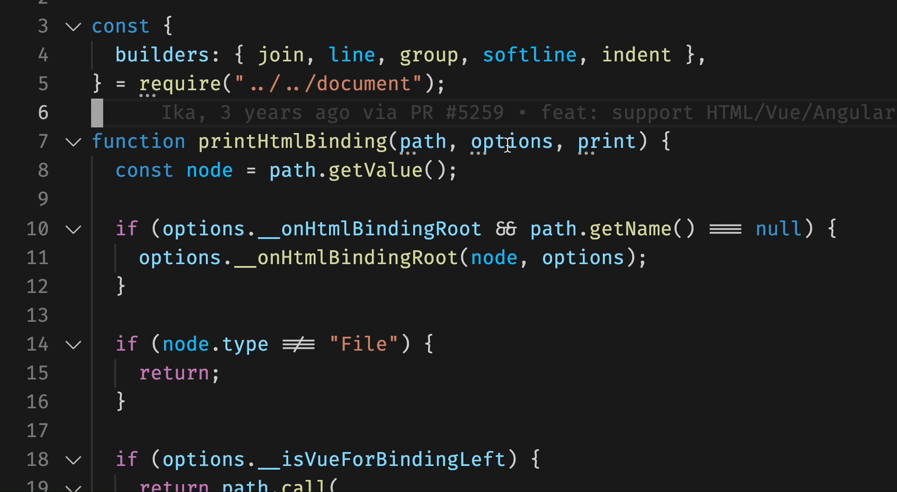

# VSCode Print It

[](https://marketplace.visualstudio.com/items?itemName=bmalehorn.print-it)
[](https://marketplace.visualstudio.com/items?itemName=bmalehorn.print-it)

Add print statements in one keystroke!

`Option + [` / `Alt + [`: wrap print statement

## Demo



## Supported Languages

| language   | example                                              |
| ---------- | ---------------------------------------------------- |
| JavaScript | `console.log("variable", variable);`                 |
| Python     | `print("variable", variable)`                        |
| Java       | `System.out.format("variable %s\n", variable);`      |
| Bash       | `echo "variable $variable"`                          |
| C#         | `Console.WriteLine("variable {0}", variable);`       |
| PHP        | `echo "\$variable "; print_r($variable); echo "\n";` |
| C++        | `std::cout << "variable " << variable << std::endl;` |
| TypeScript | `console.log("variable", variable);`                 |
| Ruby       | `pp('variable', variable)`                           |
| Go         | `fmt.Printf("variable %#v\n", variable)`             |
| Rust       | `println!(\"variable {:?}\", raw);`                  |
| React      | `console.log("variable", variable);`                 |
| Vue        | `console.log("variable", variable);`                 |
| Dart       | `print("variable = ${variable}");`                   |
| Kotlin     | `System.out.format("variable %s\n", variable)`       |
| Elixir     | `IO.puts "variable " <> inspect(variable)`           |
| Fish       | `echo "variable $variable"`                          |

## Templating

Want to change the default formatting? Set the configuration option `print-it.[language].template`:

```jsonc
  "print-it.javascriptreact.template": "console.log(\"The value of {{escaped}} is:\", {{raw}});"
```

This will make new print statements look like this:

```jsx
console.log("The value of variable is:", variable);
```

A full list of supported options is available under the "Contributions" tab.

The following variables are available:

| variable      | example             | exaplanation                           |
| ------------- | ------------------- | -------------------------------------- |
| `{{raw}}`     | `"hello " + name`   | the current selection, or current word |
| `{{escaped}}` | `\"hello \" + name` | `raw`, but escaped for use in a string |

For all other languages, you can set the value of `print-it.default.template`:

```jsonc
  "print-it.default.template": "printf(\"{{escaped}} %s\\n\", {{raw}});"
```

## Related Projects

- [Wrap Console Log Simple](https://marketplace.visualstudio.com/items?itemName=WooodHead.vscode-wrap-console-log-simple)
- [Wrap Console Log](https://marketplace.visualstudio.com/items?itemName=midnightsyntax.vscode-wrap-console-log)
